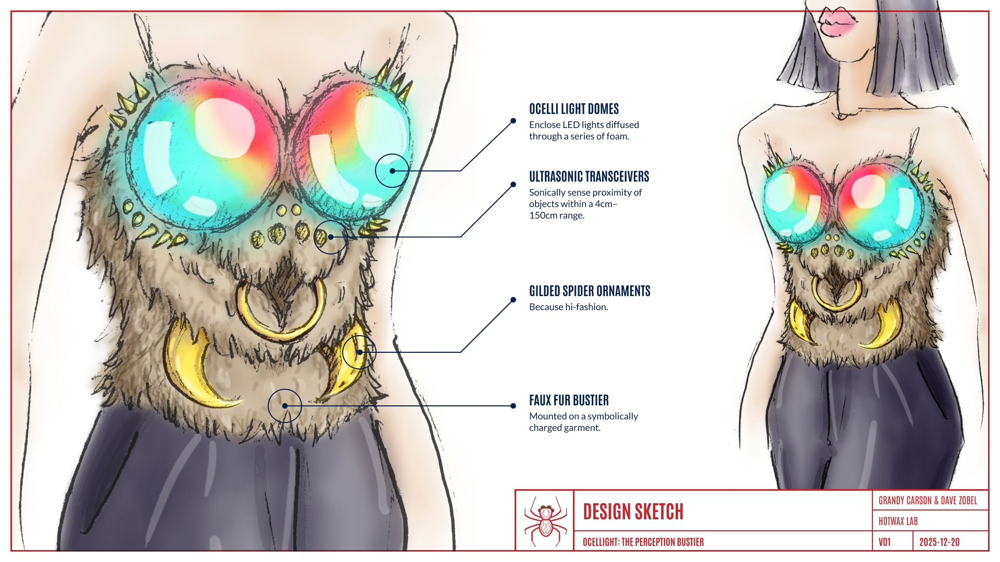

# ocellight-perception-bustier

---

## Ocellight: The Perception Bustier

#### Open-Source Wearable Hardware Project

[//]: # (
![image-title-card][]
)

[//]: # (
\ TO SCALE IMAGE, COMMENT OUT !... LINE ABOVE;
\ ELSE COMMENT OUT  LINE BELOW
)
[image-title-card]: fabrication/assets/design_sketch.png "Design sketch"

---

## Overview

Inspired by the facial features of your friendly neighborhood spider, **Ocellight: The Perception Bustier** is an open-source wearable that manifests spatial awareness through the illuminated domes of a symbolically charged female garment.

Proximity becomes light.
Personal space becomes visible.
What is often sensed only subconsciously is made explicit: displayed on the body, visible to all.

This project explores how sensing technology can be integrated into wearables in ways that feel visceral rather than ornamental, expressive rather than distracting.
Far from simply retrofitting a dynamic light show into an existing garment, **Ocellight** asks what it means to *wear* perception.

---

## What Is This?

### Ocellight = [Ocelli][def-ocelli] + Light

[def-ocelli]:
 https://en.wikipedia.org/wiki/Simple_eye_in_invertebrates#Spider_eyes
 "Wikipedia: Simple eye in invertebrates"

**Ocellight** is a body-mounted proximity-sensing system that translates nearby motion into immediate visual feedback.
It is constructed as a bustier resembling a giant spider's head, its cups repurposed into a pair of *ocelli* (the small eye-like structure found in many spiders and other creatures).
But these ocelli glow with light, their color and intensity changing in response to what they "see" in front of them.

A typical interaction is as follows:

1. Normally, both ocelli glow with a "calm" pattern of light.

1. As a nearby environmental object (e.g., a person) crosses into the wearer's personal space, ultrasonic sensors pick up its distance and velocity.

1. The ocelli begin to adopt a "warning/angry/fearful" glow, in patterns that also indicate the intruder's direction, proximity, and rapidity of approach.

1. Once the intruder&mdash;and/or the wearer&mdash;has retreated, the ocelli gradually (perhaps tentatively) return to their "calm" glow.

Thus, even without screens, sounds, or text notifications, environmental cause and effect become plainly visible.
The result is a wearable interface that reacts to its surroundings and reflects its state back to them&mdash;borrowing from non-human vision systems to extend human awareness.

---

## Why a Bustier?

The form is intentional.

**Ocellight** explores the intersection of visibility, vulnerability, and personal boundaries, particularly as they relate to the female body.
As a symbolically charged garment worn on the chest, the project leverages technology to advance wearable art into a design space rich with social meaning.

In the same way spider eyes sense proximity as danger, the bustier cups of **Ocellight** react to their environment, flashing out now a signal, now a warning&mdash;a biological metaphor rendered in electronics.

---

## [Hardware][hardware-readme]

[hardware-readme]: hardware/README.md "Hardware README"

Under the theatrics of this visually arresting electronic wearable lies a relatively straightforward and lightweight hardware system, assembled largely from off-the-shelf components:

- **Control**: Microcontroller-based system generates simple, predictable behavior
- **Inputs**: Ultrasonic proximity sensors provide short-range, human-scale interaction
- **Outputs**: Clusters of individually addressable LEDs produce immediate, glanceable feedback
- **Brightness**: Wearer-adjustable potentiometer controls LED intensity
- **Power bank**: Low current draw; manageable thermal output; swappable in seconds
- **Passive components**: Resistors, capacitors, logic level shifters, connectors, etc.

The principal custom components are:

- **Printed circuit board**: Reduces wiring complexity; improves reliability
- **Cable harness**: A single pluggable ribbon cable connects all the components, simplifying swapping

More detail is available in [hardware/README.md](/hardware/README.md).

---

## [Firmware][firmware-readme]

[firmware-readme]: firmware/README.md "Firmware README"

Sensor input is continually mapped to light output via tunable thresholds and non-complex time-based behavioral models.

The algorithm driving the light patterns mimics the jitters and fluctuations of real-life interactions.
Signal spikes and dips are smoothed out; occasional noise and uncertainty are added.

More detail is available in [firmware/README.md](/firmware/README.md).

---

## [Fabrication: Wearability as a Constraint][fabrication-readme]

[fabrication-readme]: fabrication/README.md "Fabrication README"

Building electronics for the body means designing for:

- Curved and moving surfaces
- Wearer comfort and safety over extended time periods: heat, friction, weight distribution, sharp edges, etc.
- Ability to hide or camouflage components
- Moisture and heat tolerance
- Durability, cable strain, connection fatigue 
- Public visibility and performance

These constraints shape every part of the system, from component placement to firmware timing.

More detail is available in [fabrication/README.md](/fabrication/README.md).

---

## Project Status

This repository documents an active prototype.

The design continues to evolve through iteration, presentation, and use.

---

## Open Source Intent

**Ocellight** was made possible by the Designer Development Award from [**World of WearableArt**][wow] in New Zealand.
The purpose of this award is to prioritize learning and sharing.

[wow]: https://worldofwearableart.com "World of WearableArt website"

**Ocellight** is shared as an open hardware project.

- Hardware files, firmware, and documentation are intended for reuse
- The architecture is modular and adaptable beyond this implementation
- Patterns documented here may be useful for other wearable, assistive, or expressive interfaces
- Interested persons are encouraged to adapt, simplify, or repurpose it as desired, including for other wearable or body-mounted interfaces.

See [docs/expansion-ideas.md](/docs/expansion-ideas.md) for some suggested avenues of inquiry.

---
[//]: # (
\ TODO: Unhide when fleshed out
\
\## Media
\
\- **Demo video:** see [media/demo-video.md]\(/media/demo-video.md\).
\- **Process and build images:** available in [media/photos/]\(/media/photos/\).
\
\---
)

## Acknowledgements

This project was made possible by the Designer Development Award from [**World of WearableArt**][wow] in New Zealand.

---

## Contact

Questions, reuse inquiries, and collaborations are welcome via this repository.

---
