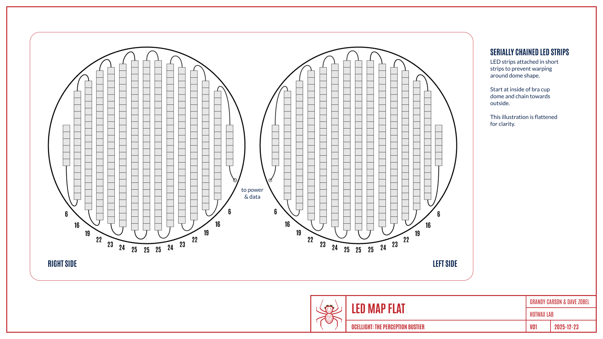
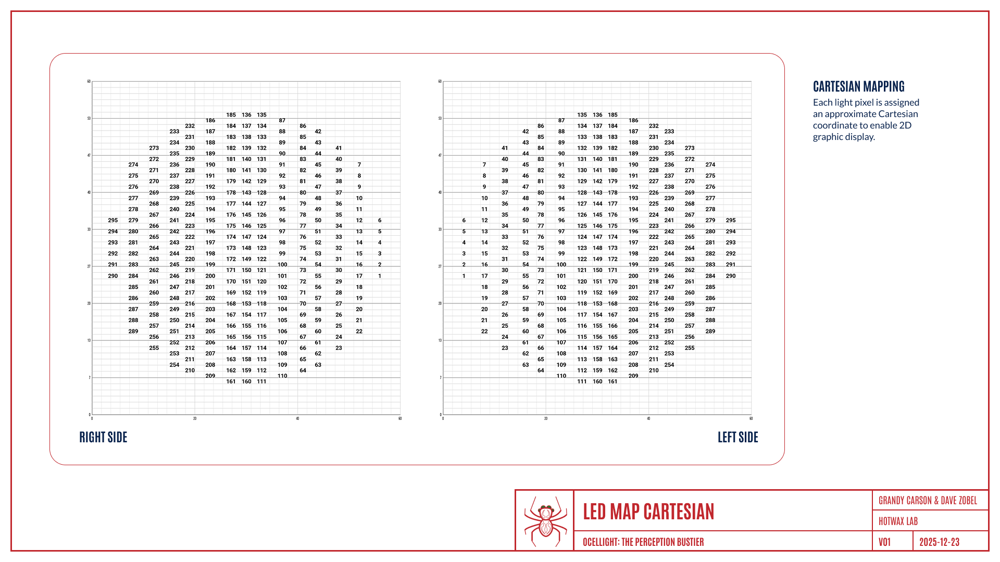

# Ocellight: The Perception Bustier

#### Open-Source Wearable Hardware Project

### Fabrication

---

# Overview

**Ocellight** is a piece of wearable art, which means that attention must be paid not only to electronic circuitry, but also to the finesse of fabrication.
This document describes the fabrication process: patterning, choice of materials, and construction techniques that allow electronics to live comfortably, visibly, and symbolically on the body.

The result gives not a locked-down fashion pattern, but rather a reproducible starting point.

---

## Garment Concept and Fit

The form of a bustier was chosen for its cultural charge and its ability to carry structure without relying on straps or backpacks.
The piece is designed to sit securely against the torso while keeping the LED ocelli clearly readable in social space.

Fit is intentionally firm but not restrictive, distributing weight across the rib cage without relying on shoulder straps.

---

## Patterning and Structure

The base pattern is derived from a traditional bustier block, modified to support:

- A rigid or semi-rigid front structure
- Mounting points for the “brain” (PCB), sensors, and ocelli (LED domes)
- Cable routing paths hidden between layers
- Spider-like features

[Pattern files][pattern] are provided as reference materials and may need to be adapted to the wearer’s body measurements and intended use.

[pattern]: Ocellight-Pattern-PRINT.pdf "Pattern file"

---

## Materials and Fabric Choices

Materials selection should balance structure, comfort, and durability:

- **Outer layer**: Canvas for structure plus faux fur to simulate a spider’s exterior
- **Inner layer**: Breathable lining suitable for skin contact, rigid enough to support boning
- **Structural support**: Canvas, interfacing, boning

Builders are encouraged to experiment with materials that suit any aesthetic, climate, or use case.

---

## Ocelli (LED Domes)

Each LED dome must diffuse the light of an LED that lies only a small distance (on the order of millimeters) beneath its inner surface.
The interior of the dome consists of multiple layers, each of which must be accessible for troubleshooting and repairability.

[//]: # (
![image-dome][]
)

[//]: # (
\ TO SCALE IMAGE, COMMENT OUT !... LINE ABOVE;
\ ELSE COMMENT OUT  LINE BELOW
)
[image-dome]: assets/fabrication_led-dome.png "LED dome: exploded view"

The construction, from inner to outer layers, is:

- **Inner dome**: Made from rigid 5&thinsp;mm EVA foam, formed to the shape of a half-dome.
- **LED light strip**: Mounted on the inner dome using adhesive.
Lights are installed in short strips in order to sit flat on the dome.
See the section on [installing LEDs](#installing-leds).
- **LED light dome**: Made from 5&thinsp;mm LED foam, which diffuses the individual light sources to create a “smear” effect.
- **Clear dome**: 6&Prime; acrylic dome that is mechanically frosted on the inside to diffuse light further.
The outside retains the high-gloss finish of acrylic to simulate the gloss on a spider’s ocelli.
- **Outer fabric**: Attached to the clear dome with Velcro along the edges, for ease of detaching.

**SAFETY NOTE**:
Chemically etching acrylic can be an extremely toxic process.
*Do your research.*
We opted for a (less perfect) mechanically frosted finishing by using high-grit sandpaper, water, and elbow grease, because we like living.

---

## Sewing and Assembly

Construction is not very different from that of a traditional bustier:

1. **Foundation**: Assemble the lining.
Structure with boning.
1. **Dome**: Attach the completed LED domes to the foundation.
1. **Spider**: Assemble the outer shell.
Install spider bit embellishments.
1. **Bustier**: Attach the lining, structure, and outer shell.

---

## Installing LEDs

COB (chip-on-board) LEDs are conveniently sold in strips with enclosed copper; however, forming the somewhat stiff strips to a dome presents a challenge.
Laying out a single continuous strip in a spiral may work for very shallow angles but will pucker on a dome like a layered cake.

We solved this issue by installing the LEDs in short strips that are then soldered together.
(See the hardware [README][hardware-readme-led-voltage-drop] file for a discussion of “laddering” the power and ground lines between strips.)

[hardware-readme-led-voltage-drop]: /hardware/README.md#led-voltage-drop "Hardware README: LED voltage drop"

[//]: # (
![image-led-install][]
)

[//]: # (
\ TO SCALE IMAGE, COMMENT OUT !... LINE ABOVE;
\ ELSE COMMENT OUT  LINE BELOW
)
[image-dome]: assets/fabrication_led-map.png "LED strips"

Individual LEDs are then visually mapped onto a Cartesian grid to give the coordinates needed for displaying images or designs.
See the firmware [README][firmware-readme] file for details.

[firmware-readme]: /firmware/README.md "Firmware README"

[//]: # (
![image-led-cartesian][]
)

[//]: # (
\ TO SCALE IMAGE, COMMENT OUT !... LINE ABOVE;
\ ELSE COMMENT OUT  LINE BELOW
)
[image-dome]: assets/fabrication_led-cartesian.png "LED Cartesian Mapping"

Patience and a lot of practice will make this process go faster.

---
## Mounting Electronics

Electronics are mounted using a combination of:

- Mechanical fasteners
- Sewn channels or pockets
- Panels (removable for maintenance)

Be sure to build in wire slack and strain relief&mdash;this garment will move!

---

## Wearability and Comfort Considerations

Because this piece is worn directly on the body:

- Sharp edges should be avoided or padded
- Weight should be distributed evenly across the torso
- Electronics must be isolated from direct skin contact

Testing should always be done incrementally and cautiously.

---

## Variations and Adaptations

The fabrication approach is intentionally modular.
This structure can support:

- Alternative garment silhouettes
- Different body placements
- Expanded sensor arrays
- Non-garment sculptural interpretations

Please adapt away and show us what terrifying creatures you build.

---

## Work in Progress

Fabrication methods continue to evolve alongside the electronics.
Photos, revisions, and updated pattern files will be added as the wearable prototype progresses.

This documentation reflects an ongoing conversation between craft, technology, and the body.

---
