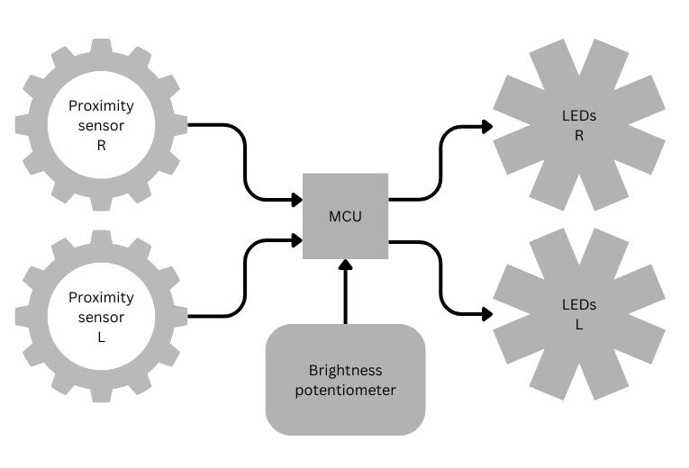
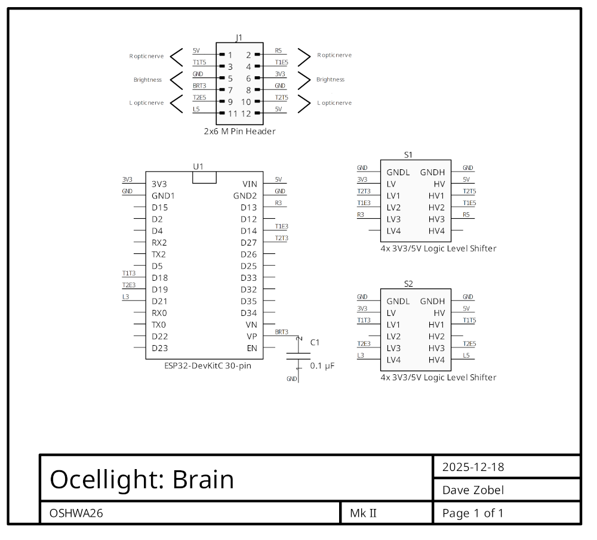
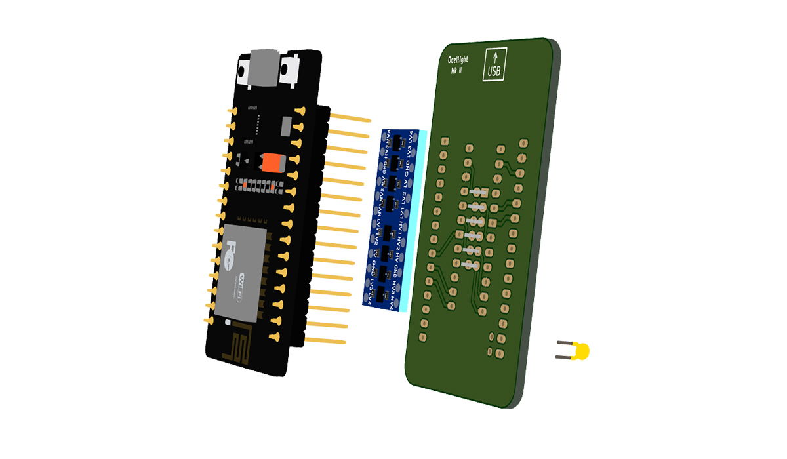

# Ocellight: The Perception Bustier

#### Open-Source Wearable Hardware Project

### Hardware

---

## Overview

In its original implementation, the **Ocellight** hardware comprises:

- two domes ("ocelli") containing strips of individually addressable LEDs
- two ultrasonic proximity sensors
- a microcontroller unit (MCU)
- a potentiometer to control brightness
- a custom PCB
- a power bank
- a physical framework, in the form of a spider's-head bustier

---

## System Block Diagram

![diagram][diagram-block]

[diagram-block]: assets/block.png "Block diagram"
[//]: # ()

Notes:
- Sensors are distributed across the garment for directional feedback
- MCU handles input triggering and processing, threshold mapping, and LED control
- LED ocelli are arranged on a dome to simulate eye-like visual output

---

## Hardware Schematic

?? TODO

---

## PCB

The custom PCB (informally known as the "brain" of Ocellight) features:
- the **MCU**
- a 12-pin male **pin header** to connect to the LEDs, the ultrasonic transceivers, and the brightness potentiometer
- two four-channel **logic level shifters** to modulate between 3V3 (the native voltage of the MCU) and 5V (the native voltage of the LEDs and the ultrasonic transceivers)
- a **capacitor** to remove noise from the brightness potentiometer signal

### Schematic

[//]: # (![image][image-PCB-schematic])
[//]: # ([image-PCB-schematic]: assets/PCB-schematic.png "PCB schematic")

### Layout

The top surface contains:
- ground plane
- most traces

The bottom surface contains:
- 3V3 plane
- 5V traces
- brightness potentiometer traces

[//]: # (![image][image-PCB-layout])
[//]: # ([image-PCB-layout]: assets/PCB-layout.png "PCB layout")

?? TODO: Key components labeled:
  - Microcontroller
  - Power input
- Highlight modular connections for future sensor expansion

### 3D Renders

?? TODO: Key components labeled:
  - Microcontroller
  - Power input
- Highlight modular connections for future sensor expansion

Front and back:

[//]: # (![image][image-PCB-3D])
[//]: # ([image-PCB-3D]: assets/PCB-3D.png "PCB 3D")

Exploded view:

[//]: # (![image][image-PCB-3D-exploded])
[//]: # ([image-PCB-3D-exploded]: assets/PCB-3D-exploded.png "PCB 3D")

---

## Key Design Notes

- Low-power, low-heat design for safe, extended wear
- Modular connectors allow additional sensor types (touch, motion, temperature)
- Placement optimized for curved surfaces on a chest-mounted garment

---

## Future Expandability

The PCB layout supports adding:
- Capacitive touch sensors
- IMU / accelerometer modules
- Additional LED clusters
- Alternative microcontroller options for experimental builds

---

## Devices

- **Microcontroller unit (MCU)**:
	- ESP32-DevKitC version 1 (ESP-WROOM-32).
	- 30-pin DIP (specific [pinout][pinout] expected by custom PCB).
	- USB-C connector.

[pinout]: https://javanelec.com/stfiles/getappdocument/1/true/f94d9c02-935a-4075-8484-f57aec67dcc0.pdf#page=8 "Pinout diagram"

- **Brightness potentiometer**:
	- Controls the overall brightness of the LEDs, from full off to full on.
	- Adjustable by the wearer.
	- Driven by the MCU's 3V3 output.

- **Power bank**:
	- Drives the microcontroller unit, the LEDs, and the ultrasonic transceivers.
	- Integrated into the garment.
	- Specifications: USB-A, 5V, 20W nominal.

- **On/off switch**:
	- There is no built-in power switch.
The system is active whenever the power bank is supplying power to the microcontroller unit and the LEDs.

---

## Notes for Builders

### Bench test:

- Test LED response
- Test each sensor individually
- Verify LED behavior under varied lighting conditions
- Verify sensor behavior under varied conditions of ambient temperature and humidity

### In operation:

- Monitor heat during extended operation

---

## Open Source Use

This hardware design (including PCB design) is shared as part of an open hardware project.

You are encouraged to adapt, simplify, or repurpose it for other wearable or body-mounted interfaces.
If you do, consider how behavior, feedback, and failure will be *felt,* not just measured.

---
