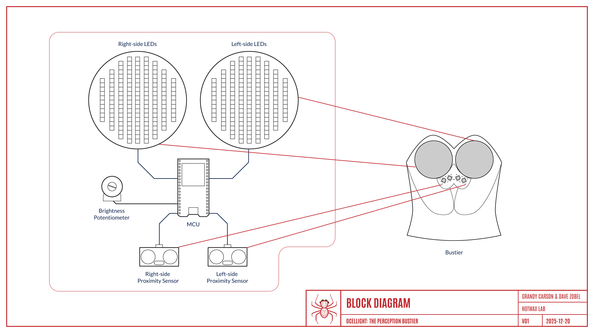
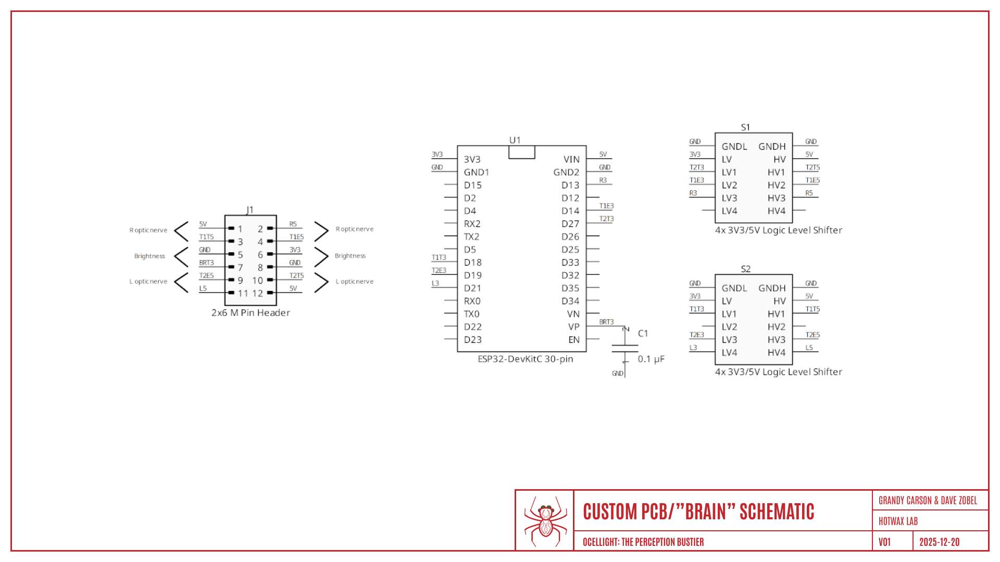
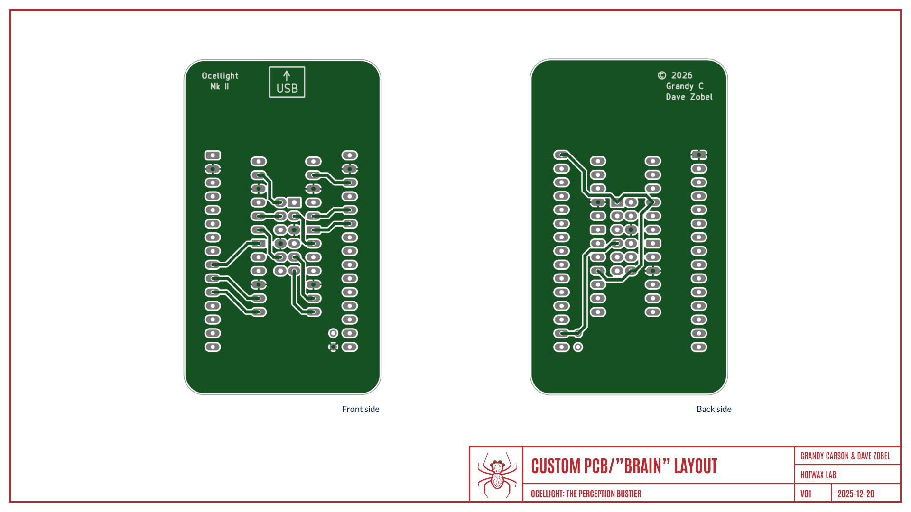
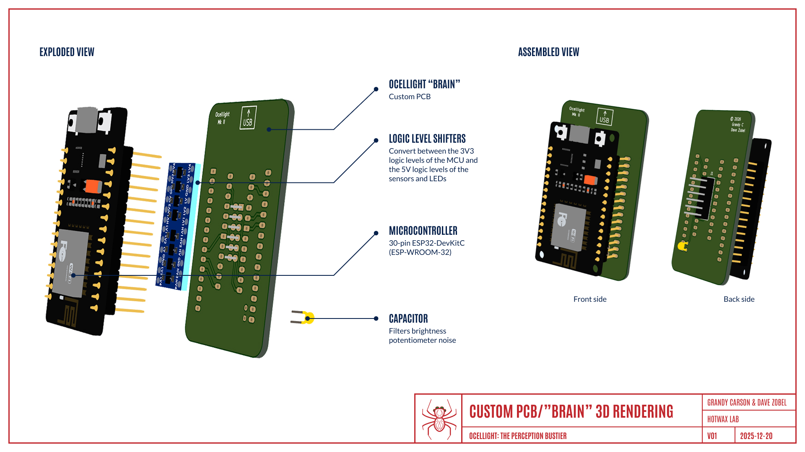

# Ocellight: The Perception Bustier

#### Open-Source Wearable Hardware Project

### Hardware

---

## Overview

In its nominal implementation, the **Ocellight** hardware comprises:

- two collections of densely packed strips of individually addressable LEDs
- two ultrasonic proximity sensors
- a microcontroller unit (MCU)
- a potentiometer to control brightness
- a custom PCB
- a power bank

The physical framework containing all these components is a wearable, in the form of a spider's-head bustier.

The LEDs are packed into two translucent domes that resemble colorful, glowing eyes ("ocelli").

The sensors are discreetly embedded&mdash;hidden in plain sight&mdash;in the material of the wearable, just below the ocelli.

The remaining hardware is fully contained inside the hidden pockets and folds of the bustier.

---

## Key Design Notes

- Low-power/low-heat design, safe for extended wear
- Optimized for curved surfaces on a chest-mounted garment
- Modular connectors (pin headers, MCU standoff) allow for quick swapping of key components
- All processing is performed locally by a single microcontroller

---

## System Block Diagram

[//]: # (
![image-block-diagram][]
)

[//]: # (
\ TO SCALE IMAGE, COMMENT OUT !... LINE ABOVE;
\ ELSE COMMENT OUT  LINE BELOW
)
[image-block-diagram]: assets/hardware_block-diagram.png "Block diagram"

Notes:
1. Multiple ultrasonic transceivers (proximity sensors) provide directional sensing.
1. Individually addressable LEDs provide unlimited opportunities for custom, non-duplicated display modes.
1. MCU handles input triggering and processing, threshold mapping, and LED control.
1. Brightness potentiometer allows overall brightness to be adjusted manually, according to ambient lighting conditions.

---
[//]: # (
\ TODO: Unhide when fleshed out
\
\## Hardware Schematic
\
\\//]: # \(
\![image-hardware-schematic][]
\)
\
\[//]: # \(
\\ TO SCALE IMAGE, COMMENT OUT !... LINE ABOVE;
\\ ELSE COMMENT OUT  LINE BELOW
\)
\[image-hardware-schematic]: assets/hardware_schematic.png "Hardware schematic"
\
\
\[//]: # \(
\ TODO: Explain all signal names
\ TODO: Label optic nerves
\)
\
\---
)

## Components

- **Microcontroller unit (MCU)**:

	- ESP32-DevKitC version 1 (ESP-WROOM-32) family
	- 30-pin DIP (specific [pinout][] expected by custom PCB)
	- USB-C connector
	- Voltage: 3V3

[pinout]:
 https://javanelec.com/stfiles/getappdocument/1/true/f94d9c02-935a-4075-8484-f57aec67dcc0.pdf#page=8
 "Pinout diagram"

- **LED**:

	- WS2812B or similar
	- Preferred density: 160/mm
	- Preferred width: 5&thinsp;mm or less
	- Voltage: 5V

- **Proximity sensor**:

	- HC-SR04 or similar
	- Preferred diameter: 8&thinsp;mm or less
	- Operating frequency: 40&thinsp;kHz
	- Effectual angle: 15&deg;
	- Voltage: 5V

- **Brightness potentiometer**:

	- Controls the overall brightness of the LEDs, from full-off to full-on
	- Adjustable by the wearer
	- Voltage: 0V&ndash;3V3

- **Power bank**:

	- Drives the microcontroller unit, the LEDs, and the ultrasonic transceivers
	- Specifications: USB-A, 5V, 20W nominal

---

## PCB

The custom printed circuit board (informally known as the "brain" of **Ocellight**) features:
- the 30-pin **MCU** (ESP32 DevKitC family)
- a 12-pin male **pin header** to connect to the LEDs, the ultrasonic transceivers, and the brightness potentiometer
- two four-channel **logic level shifters** to modulate between 3V3 (the native voltage of the MCU) and 5V (the native voltage of the LEDs and the ultrasonic transceivers)
- a filter **capacitor** to remove noise from the brightness potentiometer signal

---

### Schematic

[//]: # (
![image][image-PCB-schematic]
)

[//]: # (
\ TO SCALE IMAGE, COMMENT OUT !... LINE ABOVE;
\ ELSE COMMENT OUT  LINE BELOW
)
[image-PCB-schematic]: assets/hardware_pcb-schematic.png "PCB schematic"

[//TODO]: # (
Explain all signal names
)

---

### Layout

[//]: # (
![image][image-PCB-layout]
)

[//]: # (
\ TO SCALE IMAGE, COMMENT OUT !... LINE ABOVE;
\ ELSE COMMENT OUT  LINE BELOW
)
[image-PCB-layout]: assets/hardware_pcb-layout.png "PCB layout"

The top copper layer contains:

- ground plane
- most traces

The bottom copper layer contains:

- 3V3 plane
- 5V trace
- brightness potentiometer trace

To reduce the overall footprint, some components are physically piggybacked:

- The logic level shifters fit under the microcontroller, which is on standoffs for ease of swapping
- The pin header fits under the logic level shifters on the opposite side of the board

---

### 3D Render

[//]: # (
\ TODO: Label key components:
\	MCU, pin header, logic level shifters, capacitor, USB power input
)

[//]: # (
![image][image-PCB-3D]
)

[//]: # (
\ TO SCALE IMAGE, COMMENT OUT !... LINE ABOVE;
\ ELSE COMMENT OUT  LINE BELOW
)
[image-PCB-3D]: assets/hardware_pcb-rendering.png "PCB rendering"

---

## Limitations and Workarounds

### Power-On

The nominal design of this project includes no built-in power switch.
The system is active whenever the power bank is connected to the microcontroller unit and the LEDs.

To avoid parasitic power draw, the MCU should never be energized unless the LEDs are also energized

### LED Voltage Drop

Individually addressable LEDs typically suffer from substantial voltage drop over distances of a few meters, causing LEDs far from the power source to acquire a dim, yellow glow.

The workaround is to apply voltage injection.
This can be implemented by "laddering" the voltage and ground signals from each strip of LEDs to the next, taking advantage of the fact that the LED strips used in the cups are inherently only a few decimeters long at most.

### LED Power

To avoid burning out the MCU, the LEDs must not draw their power from the MCU's 5V power supply.
Instead, they must be powered directly from the power bank.

To avoid voltage drops, a 0.1&thinsp;&micro;F buffer capacitor is placed across the power and ground lines to each LED strip, as close as practical to the first LED.

If the power bank is incapable of supplying sufficient power, some LEDs may be seen to glow with a dim or yellow light at high brightness levels.

### LED Data Ringing

The data line from the MCU to the first LED on an LED strip is subject to ringing, particularly at lengths on the order of meters or longer.
Although this is likely not an issue with the short data lines in a typical **Ocellight** implementation, it is minimized by installing a resistor (nominally 330&thinsp;&ohm;) in series on the data line, as close as practical to the first LED on the strip.

### Logic Level Shifting

The specific MCU used in the nominal architecture of the project runs on a voltage level of 3V3.
The LEDs and proximity sensors expect a voltage level of 5V.

Although the MCU may be able to get away with using 3V3 to indicate logic level "one," the use of a logic level shifter is preferred, for cleaner data.

---

## Future Expandability

The modular hardware design supports adding and swapping numerous peripherals and key components, including:

- sensors (e.g., touch, motion, temperature, humidity)
- displays and output devices (e.g., additional LED strips, single LEDs)
- other input devices (e.g., hue potentiometer)

With a PCB redesign, the microcontroller itself can be replaced with a different one or with a single-board computer.

See [docs/expansion-ideas.md](/docs/expansion-ideas.md) for some suggested avenues of inquiry.

---

## Notes for Builders

### Bench test

- Test LED response
- Test each sensor individually
- Verify LED behavior under varied lighting conditions
- Verify sensor behavior under varied conditions of ambient temperature and humidity

### Live test

- Power bank depletion varies with light intensity
- Monitor heat during extended operation

---
